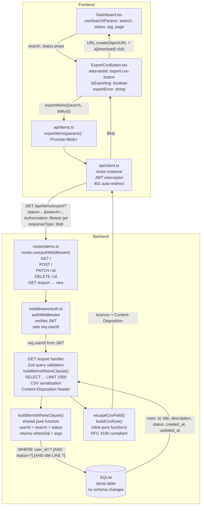
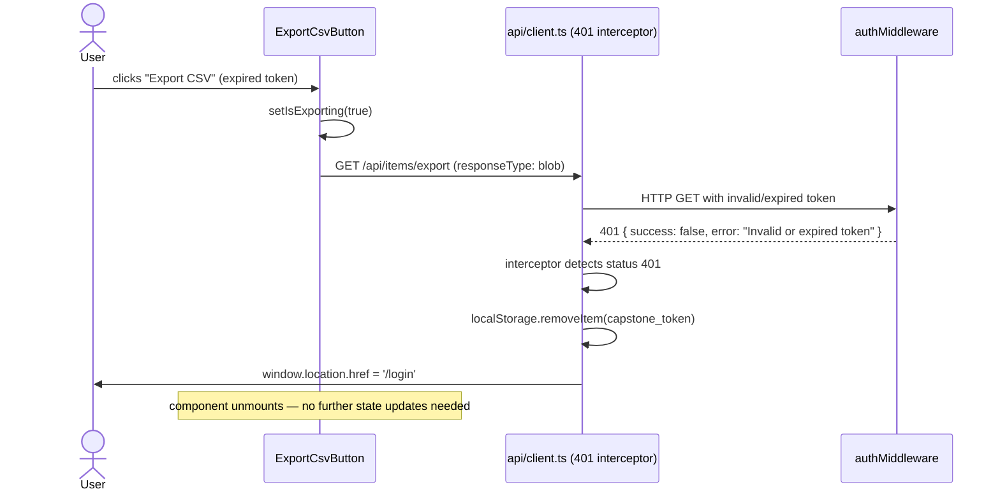
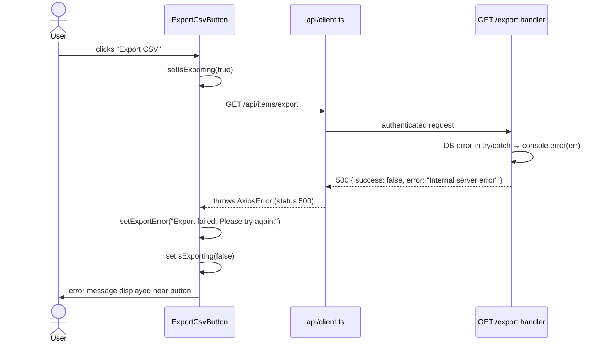

# Architecture — Export Items List to CSV

## Overview

This design adds a `GET /api/items/export` endpoint to the existing items router and an "Export CSV" button to the Dashboard page. The endpoint returns the authenticated user's filtered items as a RFC 4180-compliant CSV file. It reuses the same filter-building logic as the existing `GET /api/items` list endpoint and enforces user-scope isolation via `authMiddleware`. No database schema changes are required. No new npm packages are introduced.

The feature touches three existing files and introduces one new component:

- `backend/src/routes/items.ts` — new `GET /export` route + shared `buildItemsWhereClause` helper extracted from the existing list handler
- `frontend/src/api/items.ts` — new `exportItems()` function using the existing Axios instance
- `frontend/src/pages/Dashboard.tsx` — renders the new `ExportCsvButton` component
- `frontend/src/components/ExportCsvButton.tsx` — new component (button, loading state, blob download logic)

## Component Diagram



## Sequence Diagrams

### Happy Path — Successful CSV Export

```mermaid
sequenceDiagram
    actor User
    participant Dashboard
    participant ExportBtn as ExportCsvButton
    participant ApiItems as api/items.ts
    participant AxiosClient as api/client.ts
    participant AuthMW as authMiddleware
    participant Handler as GET /export handler
    participant SQLite

    User->>Dashboard: clicks "Export CSV"
    Dashboard->>ExportBtn: passes search + status from useSearchParams()
    ExportBtn->>ExportBtn: setIsExporting(true) — button disabled
    ExportBtn->>ApiItems: exportItems({ search, status })
    ApiItems->>AxiosClient: GET /api/items/export?status=...&search=... (responseType: blob)
    AxiosClient->>AxiosClient: interceptor injects Authorization: Bearer token
    AxiosClient->>AuthMW: HTTP GET /api/items/export
    AuthMW->>AuthMW: jwt.verify(token) → req.userId = N
    AuthMW->>Handler: next()
    Handler->>Handler: exportQuerySchema.safeParse(req.query) — validates status + search
    Handler->>Handler: buildItemsWhereClause(req.userId, search, status)
    Handler->>SQLite: SELECT id,title,description,status,created_at,updated_at FROM items WHERE user_id=? [filters] ORDER BY created_at DESC LIMIT 1000
    SQLite-->>Handler: rows (0..1000)
    Handler->>Handler: serialize header row + data rows via escapeCsvField / buildCsvRow
    Handler-->>AxiosClient: 200 text/csv Content-Disposition: attachment; filename="items-export-YYYY-MM-DD.csv"
    AxiosClient-->>ApiItems: Blob
    ApiItems-->>ExportBtn: Blob
    ExportBtn->>ExportBtn: URL.createObjectURL(blob)
    ExportBtn->>ExportBtn: create <a href=objectUrl download="items-export-YYYY-MM-DD.csv"> + click()
    ExportBtn->>User: browser initiates file download (stays on Dashboard)
    ExportBtn->>ExportBtn: URL.revokeObjectURL() + setIsExporting(false)
```

### Error Path — Unauthenticated / Expired Token (401)



### Error Path — Server Error (500)



## Database Schema Changes

### Current Schema (relevant tables)

```sql
CREATE TABLE IF NOT EXISTS items (
  id          INTEGER PRIMARY KEY AUTOINCREMENT,
  title       TEXT NOT NULL,
  description TEXT,
  status      TEXT DEFAULT 'active',
  user_id     INTEGER REFERENCES users(id),
  created_at  DATETIME DEFAULT CURRENT_TIMESTAMP,
  updated_at  DATETIME,
  tags        TEXT
);
```

### Proposed Changes

No schema changes are required. The six columns required for CSV export (`id`, `title`, `description`, `status`, `created_at`, `updated_at`) already exist in the `items` table. The `user_id` column is used for scope isolation in the WHERE clause and `tags` is excluded from the export per requirements scope.

### Migration Strategy

No migration is needed for this feature. The `initDb()` function in `backend/src/db/init.ts` and its additive `PRAGMA table_info` pattern remain unchanged.

## API Contract Changes

### New / Modified Endpoints

| Method | Path | Auth | Request Body | Response |
|--------|------|------|-------------|----------|
| GET | `/api/items/export` | Required — JWT Bearer via `authMiddleware` (inherited from `router.use`) | None | `200 text/csv` with `Content-Disposition: attachment` on success; `400 application/json` on invalid query params; `401 application/json` on auth failure; `500 application/json` on server error |

**Query Parameters:**

| Parameter | Type | Required | Constraints | Description |
|-----------|------|----------|-------------|-------------|
| `status` | string | No | enum: `active`, `completed`, `archived`, `all` | Filter by item status. Omit or pass `all` to include all statuses. |
| `search` | string | No | max 200 characters | Filters items whose `title` or `description` contains this text (case-insensitive LIKE). |

The `tag` query parameter is intentionally excluded from the export endpoint per requirements scope (FR-05, FR-06, FR-12 do not include tag filtering).

**Success Response Headers:**
```
HTTP/1.1 200 OK
Content-Type: text/csv
Content-Disposition: attachment; filename="items-export-2026-07-31.csv"
```

**Success Response Body — CSV (at minimum, header row only for zero results):**
```
id,title,description,status,created_at,updated_at
1,Buy groceries,"Milk, eggs, bread",active,2026-07-01T10:00:00.000Z,2026-07-02T09:00:00.000Z
2,Meeting notes,"He said ""hello""",completed,2026-07-03T08:00:00.000Z,
```

**Error Response — 400 (invalid query params):**
```json
{ "success": false, "error": "Invalid query parameters" }
```

**Error Response — 401 (missing or expired token):**
```json
{ "success": false, "error": "Missing or invalid Authorization header" }
```

**Error Response — 500:**
```json
{ "success": false, "error": "Internal server error" }
```

### Validation Rules

Zod schema applied to `req.query` before the DB query executes:

```typescript
const exportQuerySchema = z.object({
  status: z.enum(['active', 'completed', 'archived', 'all']).optional(),
  search: z.string().max(200).optional(),
})
```

- `userId` is always sourced from `req.userId` (set by `authMiddleware` from the verified JWT payload). No `user_id` field is present in the export schema. Any `user_id` query parameter supplied by the client is silently discarded.
- `status` values of `'all'` and `undefined` are treated equivalently — no status filter is applied.
- `search` trimmed before LIKE binding; empty string treated as no filter.

## Frontend Changes

### New Components

**`frontend/src/components/ExportCsvButton.tsx`**

```typescript
interface ExportCsvButtonProps {
  search: string   // current search query from Dashboard URL params
  status: string   // current status filter from Dashboard URL params ('all' | 'active' | 'completed' | 'archived')
}
```

Renders a Tailwind-styled `<button>` with `data-testid="export-csv-button"`. Manages two local React state fields:

- `isExporting: boolean` — disables the button and shows a loading label from click until download is initiated or an error occurs (satisfies NFR-03).
- `exportError: string` — displays an inline error message below the button if the export fails.

On click the component:
1. Sets `isExporting(true)`.
2. Calls `exportItems({ search, status })` from `api/items.ts`.
3. Receives a `Blob` and calls `URL.createObjectURL(blob)`.
4. Creates a temporary `<a>` element with the `download` attribute set to `items-export-YYYY-MM-DD.csv` (date generated client-side via `new Date().toISOString().slice(0, 10)`).
5. Programmatically clicks the element to initiate the browser download (user stays on Dashboard, satisfying FR-09).
6. Calls `URL.revokeObjectURL()` to release the object URL.
7. Sets `isExporting(false)` in a `finally` block.

Error handling: non-401 errors set `exportError`. 401 errors are handled globally by the Axios interceptor (redirect to `/login`) before the component catch block runs.

### Modified Components

**`frontend/src/pages/Dashboard.tsx`**

- Import `ExportCsvButton` from `../components/ExportCsvButton`.
- Add `<ExportCsvButton search={search} status={status} />` inside the existing filter bar `<div>` (the `flex gap-3` row that contains `SearchBar`, `StatusFilter`, and `TagFilter`).
- The `search` and `status` values are already derived from `useSearchParams()` — no additional state is introduced.
- All existing item CRUD handlers, pagination, tag filtering, and loading state are unchanged.

**`frontend/src/api/items.ts`**

Add one new exported function below the existing `deleteItem` function:

```typescript
export async function exportItems(params: {
  search?: string
  status?: string
}): Promise<Blob> {
  const cleanParams: Record<string, string> = {}
  if (params.search?.trim()) cleanParams.search = params.search.trim()
  if (params.status && params.status !== 'all') cleanParams.status = params.status
  const res = await client.get<Blob>('/items/export', {
    params: cleanParams,
    responseType: 'blob',
  })
  return res.data
}
```

This function uses the existing `client` Axios instance, which injects the JWT `Authorization` header automatically via the request interceptor. No second Axios instance is created.

### State Changes

No new Zustand store fields are required. The `authStore` (`token`, `email`, `setAuth`, `logout`) is unchanged. Filter state (`search`, `status`) is already managed via `useSearchParams()` in `Dashboard.tsx` and is passed as props to `ExportCsvButton`. The `isExporting` and `exportError` fields are transient UI state managed with `useState` inside `ExportCsvButton` — they do not need to survive navigation or be shared across components.

## Architecture Decision Records (ADRs)

### ADR-01: CSV Serialization — Native String Building vs Third-Party Library
- **Status**: Accepted
- **Context**: The export feature must serialize SQLite rows to RFC 4180 CSV. Options considered: (a) a dedicated npm package such as `csv-stringify`, or (b) an inline pure function implementing the RFC 4180 escaping rules (wrap field in double quotes if it contains a comma, double-quote, carriage return, or newline; escape internal double-quotes by doubling them).
- **Decision**: Implement serialization as two inline helper functions (`escapeCsvField` and `buildCsvRow`) within `backend/src/routes/items.ts`. No new npm package is introduced.
- **Consequences**: RFC 4180 escaping is fully specified and the export schema is fixed at six columns, making the inline implementation straightforward and fully auditable. Adding a dependency for a ~10-line function would violate the project convention requiring ADR justification for every new package. If the column set grows or nested quoting rules become complex in a future iteration, adopting a library should be reconsidered at that time.

### ADR-02: Frontend Download Mechanism — Axios+Blob vs Direct Anchor href
- **Status**: Accepted
- **Context**: Two approaches exist for triggering a CSV file download. (a) Direct anchor: embed the JWT as a query parameter in the URL (e.g., `/api/items/export?token=<jwt>`) and use an `<a href=... download>` element directly. (b) Programmatic: call the export endpoint through the existing Axios instance (which injects JWT via the `Authorization: Bearer` header) and trigger download via `URL.createObjectURL(blob)` on the returned Blob.
- **Decision**: Use the existing Axios instance with `responseType: 'blob'` and a programmatic `URL.createObjectURL` download (approach b).
- **Consequences**: The JWT is passed in the `Authorization` header rather than as a URL query parameter, preventing token leakage in browser history, server access logs, referrer headers, and bookmarks. The existing 401 interceptor in `api/client.ts` handles session expiry transparently. The convention "all HTTP calls go through `api/client.ts`" is preserved. The Blob URL must be released with `URL.revokeObjectURL()` after the download click — this is handled in the component's `finally` block.

### ADR-03: Filter Logic — Extract Shared Helper vs Duplicate in Export Handler
- **Status**: Accepted
- **Context**: FR-13 requires the export endpoint to produce results consistent with the list endpoint by reusing the same filtering logic. The current filter-building code (WHERE clause construction and parameterized args assembly) is inlined in the `GET /` handler in `items.ts`.
- **Decision**: Extract a `buildItemsWhereClause(userId: number, search: string | null, status: string | null)` pure helper function within `backend/src/routes/items.ts`. Both `GET /` and `GET /export` call this helper. The `tag` filter remains in the list handler only (not in scope for export per requirements).
- **Consequences**: A single implementation guarantees consistent filtering results between the list view and the export, satisfying FR-13. The helper is a pure function with no side effects, making it straightforward to unit-test. Duplication is avoided; a future change to filter semantics (e.g., case sensitivity) only needs to be made in one place.

## FR Traceability Matrix

| FR-ID | Architecture Element | Notes |
|-------|---------------------|-------|
| FR-01 | `ExportCsvButton` component rendered inside `Dashboard.tsx` filter bar | Visible to all authenticated users on Dashboard load |
| FR-02 | `GET /api/items/export` in `backend/src/routes/items.ts`; `res.setHeader('Content-Type', 'text/csv')` | CSV body built by `escapeCsvField` / `buildCsvRow` helpers |
| FR-03 | `router.use(authMiddleware)` at line 7 of `items.ts`; `authMiddleware` returns 401 JSON on missing or invalid token | Applies automatically to all routes on the router including `/export` |
| FR-04 | `WHERE user_id = ?` with `args: [req.userId]`; `req.userId` set exclusively by `authMiddleware` from JWT; `exportQuerySchema` does not include a `user_id` field | Client-supplied `user_id` param silently ignored |
| FR-05 | `exportQuerySchema.status` (Zod enum); `status = ?` clause in `buildItemsWhereClause()`; `ExportCsvButton` passes `status` prop from `useSearchParams()` | `'all'` and `undefined` produce no status WHERE clause |
| FR-06 | `exportQuerySchema.search` (Zod string max 200); `(title LIKE ? OR description LIKE ?)` in `buildItemsWhereClause()`; `ExportCsvButton` passes `search` prop from `useSearchParams()` | Parameterized `%search%` LIKE binding |
| FR-07 | Hardcoded CSV header line `id,title,description,status,created_at,updated_at` as first output line; SELECT lists exactly these 6 columns explicitly | Column order is fixed in code |
| FR-08 | `LIMIT 1000` in the SELECT inside the export handler | Cap applied at the SQL layer before serialization |
| FR-09 | `Content-Disposition: attachment; filename="items-export-YYYY-MM-DD.csv"` response header; `ExportCsvButton` programmatic `<a download>` click keeps user on Dashboard | Date computed server-side for Content-Disposition; duplicated client-side for the `download` attribute |
| FR-10 | When the filtered query returns zero rows, the CSV output contains only the header row; the loop over `rows` produces no additional lines | No special-case branching needed |
| FR-11 | `escapeCsvField()` wraps any field containing `,`, `"`, `\r`, or `\n` in double quotes and escapes internal `"` as `""` | RFC 4180 sections 2.6 and 2.7 |
| FR-12 | `ExportCsvButton` receives `search` and `status` as props from Dashboard (both sourced from `useSearchParams()`); `exportItems()` passes them as Axios query params | Consistent with params used by `fetchItems()` for the list view |
| FR-13 | `buildItemsWhereClause()` pure helper called by both `GET /` list handler and `GET /export` handler (ADR-03) | Single implementation guarantees identical filter results for same inputs |

## Security Analysis

### OWASP Top 10 Assessment for New Attack Surface

**A01 — Broken Access Control**
Risk: A client could supply a `user_id` query parameter attempting to export another user's items.
Mitigation: `userId` is sourced exclusively from `req.userId`, set by `authMiddleware` from the verified JWT payload. The `exportQuerySchema` contains no `user_id` field; any such parameter is discarded before reaching the DB query. The WHERE clause always includes `user_id = ?` bound to the authenticated user's ID (NFR-02).

**A02 — Cryptographic Failures**
Risk: No new cryptographic operations are introduced by this feature.
Mitigation: JWT verification continues to use the existing `authMiddleware` with `jsonwebtoken`. No new secrets, keys, or hashing operations are added.

**A03 — Injection**
Risk: The `search` query parameter could contain SQL injection payloads.
Mitigation: All DB values are passed as parameterized args using `@libsql/client`'s `{ sql, args }` format — no string concatenation in SQL. `status` is constrained to a Zod enum (three values). `search` is bounded to 200 characters by Zod and used only in a LIKE clause with `%` wrapping applied in code.

**A04 — Insecure Design**
Risk: Unbounded exports could expose large amounts of user data or exhaust server memory.
Mitigation: `LIMIT 1000` is applied at the SQL layer (FR-08). `search` is capped at 200 characters. Results are scoped to the authenticated user. The 1000-row limit keeps CSV response sizes predictable and within the NFR-01 3-second budget.

**A05 — Security Misconfiguration**
Risk: The new export route could be accidentally registered outside the authenticated router.
Mitigation: `authMiddleware` is applied via `router.use(authMiddleware)` at the router level in `items.ts` — not per-route. Every route registered on that router, including `/export`, inherits authentication enforcement automatically.

**A06 — Vulnerable and Outdated Components**
Risk: A new CSV library dependency could introduce a vulnerability.
Mitigation: No new npm packages are introduced (ADR-01). CSV serialization is implemented as an inline pure function with no transitive dependencies.

**A07 — Identification and Authentication Failures**
Risk: Expired or malformed JWT tokens could be accepted by the export endpoint.
Mitigation: `authMiddleware` calls `jwt.verify()` on every request; expired or invalid tokens receive a 401 response with no data returned. The Axios 401 interceptor clears localStorage and redirects to `/login` client-side.

**A08 — Software and Data Integrity Failures**
Risk: Malicious CSV content (CSV injection) could be written to the export file.
Mitigation: RFC 4180 escaping wraps all field values that contain special characters. Data is serialized from verified DB rows, not from unsanitized user input passed through verbatim. Downstream tools parsing the file receive correctly delimited fields.

**A09 — Security Logging and Monitoring Failures**
Risk: Errors in the export handler could be silently swallowed.
Mitigation: The export handler wraps the DB execution and serialization in a `try/catch` block; errors are passed to `console.error` (consistent with existing route patterns) before the 500 response is returned.

**A10 — Server-Side Request Forgery (SSRF)**
Risk: No outbound HTTP requests are made by the export handler.
Mitigation: N/A — the export flow involves only a local SQLite read and in-process string serialization.

## Risks & Mitigations

| Risk | Likelihood | Impact | Mitigation |
|------|-----------|--------|-----------|
| Route ordering conflict: Express matches `GET /export` as `GET /:id` parameter if a GET by-ID route is added in the future | Low | High | Register `GET /export` before any parameterized `GET /:id` route in `items.ts`. No `GET /:id` route currently exists; the constraint is documented here and must be enforced during Stage 5 implementation. |
| Memory leak from unreleased Blob object URLs | Medium | Low | `ExportCsvButton` calls `URL.revokeObjectURL()` in a `finally` block immediately after the programmatic anchor click, regardless of success or error. |
| Large CSV payload stalling the browser tab | Low | Medium | 1000-row hard cap and SQLite single-file I/O keep response payloads predictable. The button disabled state prevents duplicate in-flight requests (NFR-03). |
| `status=all` passed to server and rejected by Zod enum validation | Low | Low | `exportItems()` in `api/items.ts` omits the `status` param when its value is `'all'` or falsy, so the enum constraint is never triggered by the normal Dashboard filter state. |
| CSV special characters (comma, quote, newline) corrupting downstream spreadsheet applications | Low | Medium | `escapeCsvField()` covers comma, double-quote, CR (`\r`), and LF (`\n`) per RFC 4180. Stage 7 E2E tests must include items with these characters as acceptance-criteria coverage for AC-17 and AC-18. |
| JWT token exposed in server access logs or browser history | Medium | High | The Axios+Blob approach (ADR-02) passes JWT in the `Authorization` header, not as a URL query parameter. Resolved at design time. |
| Export returning `tags` or `user_id` columns in violation of FR-07 | Low | Medium | The SELECT statement explicitly names the six required columns (`id, title, description, status, created_at, updated_at`) rather than using `SELECT *`. |
