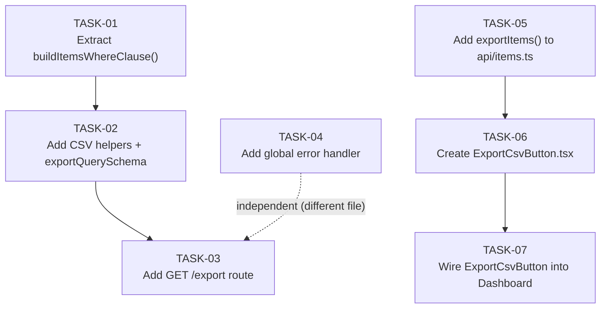

# Implementation Plan — Export Items List to CSV

## Overview

This plan implements the CSV export feature described in `architecture.md`. It touches four source files and creates one new component. The backend changes extend `backend/src/routes/items.ts` with a shared filter helper and a new `GET /export` route, and add a global error handler to `backend/src/index.ts`. The frontend changes add an `exportItems()` API function to `frontend/src/api/items.ts`, create the `ExportCsvButton` component, and wire it into the Dashboard filter bar.

All implementation conditions mandated by `design-review.md` (W-01 through W-05, and the six APPROVED-with-Conditions items) are addressed in the tasks below.

---

## Task List

### TASK-01: Extract `buildItemsWhereClause()` helper from the `GET /` handler

- **File(s)**: `backend/src/routes/items.ts`
- **Change type**: Refactor (Modify)
- **Description**: Extract the WHERE clause assembly logic currently inlined inside the `GET /` handler (the block that builds `whereClauses` and `args` for `user_id`, `search`, and `status`, lines 49–66) into a standalone pure function declared above the route handlers:

  ```typescript
  function buildItemsWhereClause(
    userId: number | null | undefined,
    search: string | null,
    status: string | null,
  ): { whereSql: string; args: (string | number | null)[] } {
    const whereClauses: string[] = ['user_id = ?']
    const args: (string | number | null)[] = [userId ?? null]
    if (search) {
      whereClauses.push('(title LIKE ? OR description LIKE ?)')
      args.push(`%${search}%`, `%${search}%`)
    }
    if (status && status !== 'all') {
      whereClauses.push('status = ?')
      args.push(status)
    }
    return { whereSql: `WHERE ${whereClauses.join(' AND ')}`, args }
  }
  ```

  Update the `GET /` handler to call this helper for the base userId/search/status clauses. The tag filter logic (`if (tag) { ... }`) must remain inlined in the `GET /` handler only — it is not moved into the shared helper. After calling the helper, the `GET /` handler appends the tag clause to the returned `args` array and extends the WHERE clause string as needed before executing the COUNT and SELECT queries.

  The net observable behavior of the existing `GET /` endpoint must be identical after this refactor.

- **Depends on**: none
- **Success criteria**:
  - `buildItemsWhereClause` is a named function declared at module scope in `items.ts`.
  - The `GET /` handler calls `buildItemsWhereClause(req.userId, search, status)` to obtain the base WHERE clause and args.
  - The `GET /` handler continues to apply the tag filter on top of the result from the helper.
  - A manual `curl GET /api/items` (or equivalent) with and without `?status=active&search=foo&tag=bar` parameters returns the same results as before the refactor.
  - No TypeScript compile errors (`tsc --noEmit` passes).
- **FR coverage**: FR-13

---

### TASK-02: Add CSV helper functions and `exportQuerySchema` to `items.ts`

- **File(s)**: `backend/src/routes/items.ts`
- **Change type**: Modify (add new code blocks)
- **Description**: Add three additions to `items.ts` in the section between the existing Zod schemas and the route handler declarations:

  1. **`escapeCsvField(value: string | number | null): string`** — Converts the value to a string (`String(value ?? '')`). If the stringified value contains any of `,`, `"`, `\r`, or `\n`, wrap the entire value in double-quotes and escape any internal `"` characters as `""`. Additionally, if the final string value (before wrapping) begins with `=`, `+`, `-`, or `@`, prepend a tab character (`\t`) inside the wrapping quotes to mitigate CSV formula injection (W-01 from `design-review.md`).

  2. **`buildCsvRow(fields: (string | number | null)[]): string`** — Maps each element through `escapeCsvField` and joins with commas, returning a single CSV row string (no trailing newline).

  3. **`exportQuerySchema`** — Zod schema applied to `req.query` in the export handler:
     ```typescript
     const exportQuerySchema = z.object({
       status: z.enum(['active', 'completed', 'archived', 'all']).optional(),
       search: z.string().max(200).optional(),
     })
     ```

- **Depends on**: TASK-01
- **Success criteria**:
  - `escapeCsvField('Buy milk, eggs')` returns `'"Buy milk, eggs"'`.
  - `escapeCsvField('He said "hello"')` returns `'"He said ""hello"""'`.
  - `escapeCsvField('=HYPERLINK("x","y")')` returns a string beginning with `"\t=` (tab prepended inside quotes).
  - `buildCsvRow([1, 'Title', null, 'active'])` returns `'1,Title,,active'`.
  - `exportQuerySchema.safeParse({ status: 'all' }).success` is `true`.
  - `exportQuerySchema.safeParse({ status: 'invalid' }).success` is `false`.
  - `tsc --noEmit` passes.
- **FR coverage**: FR-11, FR-02, FR-05, FR-07

---

### TASK-03: Add `GET /export` route handler to `items.ts`

- **File(s)**: `backend/src/routes/items.ts`
- **Change type**: Modify (add new route)
- **Description**: Add the export route handler immediately before the `export default router` line. The route must be positioned before any future parameterized `GET /:id` route. Include the mandatory inline comment directly above the handler declaration:

  ```typescript
  // IMPORTANT: must remain above any router.get('/:id', ...) route — see architecture.md ADR-03
  router.get('/export', async (req: AuthRequest, res: Response) => {
  ```

  Handler implementation steps (all inside a `try/catch` block):

  1. Parse `req.query` with `exportQuerySchema.safeParse(req.query)`. If parsing fails, return `res.status(400).json({ success: false, error: 'Invalid query parameters' })`.
  2. Extract `search` (trim, treat empty string as `null`) and `status` (treat `'all'` and `undefined` identically — no status clause).
  3. Call `buildItemsWhereClause(req.userId, search, status)` to obtain `{ whereSql, args }`.
  4. Execute:
     ```sql
     SELECT id, title, description, status, created_at, updated_at
     FROM items
     ${whereSql}
     ORDER BY created_at DESC
     LIMIT 1000
     ```
     Never use `SELECT *` in this handler.
  5. Build the complete CSV string **in memory** before touching response headers:
     - Start with the header line: `'id,title,description,status,created_at,updated_at'`
     - Append `\n` + `buildCsvRow([row.id, row.title, row.description, row.status, row.created_at, row.updated_at])` for each row.
  6. Only after the full string is built, set headers and send:
     ```typescript
     const date = new Date().toISOString().slice(0, 10)
     res.setHeader('Content-Type', 'text/csv')
     res.setHeader('Content-Disposition', `attachment; filename="items-export-${date}.csv"`)
     res.send(csvString)
     ```
  7. Catch block: `console.error(err)` then `res.status(500).json({ success: false, error: 'Internal server error' })`.

- **Depends on**: TASK-01, TASK-02
- **Success criteria**:
  - `GET /api/items/export` with a valid JWT returns HTTP 200, `Content-Type: text/csv`, and `Content-Disposition: attachment; filename="items-export-YYYY-MM-DD.csv"`.
  - The response body's first line is exactly `id,title,description,status,created_at,updated_at`.
  - `GET /api/items/export` with no Authorization header returns HTTP 401 JSON `{ success: false, error: ... }`.
  - `GET /api/items/export?status=badvalue` returns HTTP 400 JSON `{ success: false, error: "Invalid query parameters" }`.
  - `GET /api/items/export?status=active` returns only rows where `status = 'active'`.
  - `GET /api/items/export?search=foo` returns only rows where title or description contains `foo`.
  - `GET /api/items/export` when the user has zero matching items returns a response body containing exactly one line (the header row).
  - The inline comment `// IMPORTANT: must remain above any router.get('/:id', ...)` is present directly above the route declaration.
  - `tsc --noEmit` passes.
- **FR coverage**: FR-02, FR-03, FR-04, FR-05, FR-06, FR-07, FR-08, FR-09, FR-10, FR-11, FR-13

---

### TASK-04: Add global Express error handler to `index.ts`

- **File(s)**: `backend/src/index.ts`
- **Change type**: Modify
- **Description**: Add a four-argument Express error-handling middleware function after the `app.get('/api/health', ...)` handler and before the `initDb().then(...)` call. The signature must use all four parameters (Express identifies error handlers by arity):

  ```typescript
  app.use((err: Error, _req: express.Request, res: express.Response, _next: express.NextFunction) => {
    console.error(err)
    res.status(500).json({ success: false, error: 'Internal server error' })
  })
  ```

  Add `NextFunction` to the existing `express` import if not already present (or use `express.NextFunction` inline).

- **Depends on**: none
- **Success criteria**:
  - `backend/src/index.ts` contains a four-argument `app.use(...)` error handler after the health route.
  - The handler logs the error with `console.error` and returns HTTP 500 JSON matching `{ success: false, error: 'Internal server error' }`.
  - `tsc --noEmit` passes.
- **FR coverage**: NFR-04 (reliability — unhandled route errors now produce structured JSON)

---

### TASK-05: Add `exportItems()` function to the frontend API module

- **File(s)**: `frontend/src/api/items.ts`
- **Change type**: Modify (append new export)
- **Description**: Add the following exported function after the existing `deleteItem` function. No new imports are required — `client` is already imported at line 1.

  ```typescript
  export async function exportItems(params: {
    search?: string
    status?: string
  }): Promise<Blob> {
    const cleanParams: Record<string, string> = {}
    if (params.search?.trim()) cleanParams.search = params.search.trim()
    if (params.status && params.status !== 'all') cleanParams.status = params.status
    const res = await client.get<Blob>('/items/export', {
      params: cleanParams,
      responseType: 'blob',
    })
    return res.data
  }
  ```

  The `status === 'all'` guard ensures the `status` query param is omitted from the request URL when the Dashboard has no active status filter, preventing a Zod 400 error on the server.

- **Depends on**: none
- **Success criteria**:
  - `exportItems({ status: 'all', search: '' })` sends a request to `/items/export` with no `status` or `search` query params.
  - `exportItems({ status: 'active', search: 'foo' })` sends a request to `/items/export?status=active&search=foo`.
  - The function returns a `Promise<Blob>`.
  - `tsc --noEmit` (frontend) passes.
- **FR coverage**: FR-12, FR-05, FR-06

---

### TASK-06: Create `ExportCsvButton` React component

- **File(s)**: `frontend/src/components/ExportCsvButton.tsx` (new file)
- **Change type**: Create
- **Description**: Create a new React functional component file. The component:

  **Props interface:**
  ```typescript
  interface ExportCsvButtonProps {
    search: string
    status: string
  }
  ```

  **Local state:**
  - `isExporting: boolean` — initialized to `false`; set to `true` on click, reset to `false` in `finally`
  - `exportError: string` — initialized to `''`; set to an error message string on failure; cleared on each new click

  **Click handler logic:**
  1. Set `isExporting(true)` and clear `exportError('')`.
  2. Call `exportItems({ search, status })`.
  3. On success: create a Blob URL with `URL.createObjectURL(blob)`, create a temporary `<a>` element with `href` set to the object URL and `download` set to `"items-export-${new Date().toISOString().slice(0, 10)}.csv"`, append to `document.body`, call `.click()`, remove from `document.body`, then call `URL.revokeObjectURL(url)`.
  4. In `catch`: if `error.response?.data instanceof Blob`, read the Blob with `await error.response.data.text()` and attempt `JSON.parse` to extract the server error message before falling back to `"Export failed. Please try again."` (addresses W-02). Otherwise use the fallback string directly.
  5. In `finally`: set `isExporting(false)`.

  **Render output:**
  ```tsx
  <div>
    <button
      data-testid="export-csv-button"
      onClick={handleExport}
      disabled={isExporting}
      className="px-3 py-1.5 text-sm font-medium rounded-md bg-blue-600 text-white hover:bg-blue-700 disabled:opacity-50 disabled:cursor-not-allowed"
    >
      {isExporting ? 'Exporting...' : 'Export CSV'}
    </button>
    {exportError && (
      <p data-testid="export-csv-error" className="text-red-600 text-xs mt-1">
        {exportError}
      </p>
    )}
  </div>
  ```

  Import `exportItems` from `'../api/items'`. Import `useState` from `'react'`.

- **Depends on**: TASK-05
- **Success criteria**:
  - File `frontend/src/components/ExportCsvButton.tsx` exists and exports a default React component.
  - The component renders a `<button data-testid="export-csv-button">`.
  - The button text is `"Export CSV"` when not exporting and `"Exporting..."` when `isExporting` is `true`.
  - The button has the `disabled` attribute while `isExporting` is `true`.
  - When `exportError` is non-empty, a `<p data-testid="export-csv-error">` element is rendered below the button.
  - `tsc --noEmit` (frontend) passes.
- **FR coverage**: FR-01, FR-09, FR-12, NFR-03

---

### TASK-07: Wire `ExportCsvButton` into `Dashboard.tsx`

- **File(s)**: `frontend/src/pages/Dashboard.tsx`
- **Change type**: Modify
- **Description**: Make exactly two changes to `Dashboard.tsx`:

  1. Add the import at the top of the file with the other component imports:
     ```typescript
     import ExportCsvButton from '../components/ExportCsvButton'
     ```

  2. Add the component inside the existing filter bar `<div className="flex gap-3 mb-4 flex-wrap">`, after the closing `/>` of `<TagFilter>` (currently at line 113):
     ```tsx
     <ExportCsvButton search={search} status={status} />
     ```

  The `search` and `status` variables are already declared from `useSearchParams()` at lines 23–24 of `Dashboard.tsx`. No new state or effects are required. No other lines in `Dashboard.tsx` are modified.

- **Depends on**: TASK-06
- **Success criteria**:
  - `Dashboard.tsx` imports `ExportCsvButton`.
  - `<ExportCsvButton search={search} status={status} />` appears inside the filter bar `<div>`.
  - All existing Dashboard functionality (create, update, delete, search, status filter, tag filter, pagination) is unchanged.
  - `tsc --noEmit` (frontend) passes.
  - The button is visible in the browser on the Dashboard page when served locally.
- **FR coverage**: FR-01, FR-05, FR-06, FR-12

---

## Dependency Graph



---

## FR → Task Traceability

| FR-ID | Task(s) | Notes |
|-------|---------|-------|
| FR-01 | TASK-06, TASK-07 | Component created in TASK-06; rendered on Dashboard in TASK-07 |
| FR-02 | TASK-02, TASK-03 | CSV helpers in TASK-02; route with Content-Type header in TASK-03 |
| FR-03 | TASK-03 | Export route inherits `router.use(authMiddleware)` already registered at line 7 of items.ts |
| FR-04 | TASK-01, TASK-03 | `buildItemsWhereClause` always includes `user_id = ?` bound to `req.userId`; no `user_id` in `exportQuerySchema` |
| FR-05 | TASK-01, TASK-02, TASK-03, TASK-05 | Status clause in helper (TASK-01); Zod enum validates status (TASK-02); 'all' stripped before request (TASK-05) |
| FR-06 | TASK-01, TASK-02, TASK-03, TASK-05 | LIKE clause in helper (TASK-01); search validated by Zod (TASK-02); search passed as param (TASK-05) |
| FR-07 | TASK-02, TASK-03 | Header row constant defined during TASK-03 implementation; explicit 6-column SELECT in TASK-03 |
| FR-08 | TASK-03 | `LIMIT 1000` in the SELECT statement |
| FR-09 | TASK-03, TASK-06 | `Content-Disposition: attachment` header in TASK-03; programmatic `<a download>` click in TASK-06 |
| FR-10 | TASK-03 | Loop over empty `rows` array produces no additional lines after header |
| FR-11 | TASK-02, TASK-03 | `escapeCsvField()` implements RFC 4180 escaping in TASK-02; called via `buildCsvRow()` in TASK-03 |
| FR-12 | TASK-05, TASK-06, TASK-07 | `exportItems()` passes params (TASK-05); component receives props (TASK-06); props sourced from URL state (TASK-07) |
| FR-13 | TASK-01, TASK-03 | Shared helper called by both `GET /` (TASK-01) and `GET /export` (TASK-03) |
| NFR-01 | TASK-03 | `LIMIT 1000` at SQL layer; in-memory CSV build; no streaming required |
| NFR-02 | TASK-01, TASK-03 | `userId` from `req.userId` only; `exportQuerySchema` contains no `user_id` field |
| NFR-03 | TASK-06 | `isExporting` state disables button; `finally` block resets it; loading label shown |
| NFR-04 | TASK-03, TASK-04 | Full CSV built before headers set (TASK-03); global error handler returns JSON 500 (TASK-04) |

---

## Implementation Order

1. **TASK-01** — no dependencies; start here; establishes the shared helper all export logic depends on
2. **TASK-04** — no dependencies; can be done in parallel with TASK-01 (different file: `index.ts`)
3. **TASK-05** — no dependencies; can be done in parallel with TASK-01 and TASK-04 (different file: frontend `api/items.ts`)
4. **TASK-02** — depends on TASK-01 (same file, sequential edits)
5. **TASK-03** — depends on TASK-01 and TASK-02 (same file; uses helper and CSV functions)
6. **TASK-06** — depends on TASK-05 (imports `exportItems`)
7. **TASK-07** — depends on TASK-06 (imports `ExportCsvButton`)

---

## Estimated Risk Areas

| Task | Risk | Mitigation |
|------|------|-----------|
| TASK-01 | Refactoring existing `GET /` handler may accidentally remove the tag filter clause, changing list endpoint behavior | After extraction, manually verify `GET /items?tag=foo` still filters correctly; the tag clause must remain in the handler, not the helper |
| TASK-03 | Building CSV string after `res.setHeader()` would prevent the 500 JSON fallback if serialization throws | Enforce the order: full CSV string built inside `try` block first, then `res.setHeader()` and `res.send()` in sequence as the final step before `return` |
| TASK-03 | Route registered after a future parameterized `GET /:id` would cause Express to match `/export` as `{ id: 'export' }` | The ADR-03 comment is mandatory; currently no `GET /:id` route exists, so this is a future-proofing concern only |
| TASK-05 | Passing `status=all` to the server triggers a Zod 400 error | The `if (params.status && params.status !== 'all')` guard in `exportItems()` strips it; verify this guard is present |
| TASK-06 | `URL.revokeObjectURL()` not called on the success path causes a memory leak | Revocation must happen in the `finally` block after the programmatic click, not only in the catch path |
| TASK-06 | `error.response?.data instanceof Blob` check omitted leaves the catch block unable to surface the server error message | Implement the Blob-to-text fallback per W-02 from `design-review.md` |
